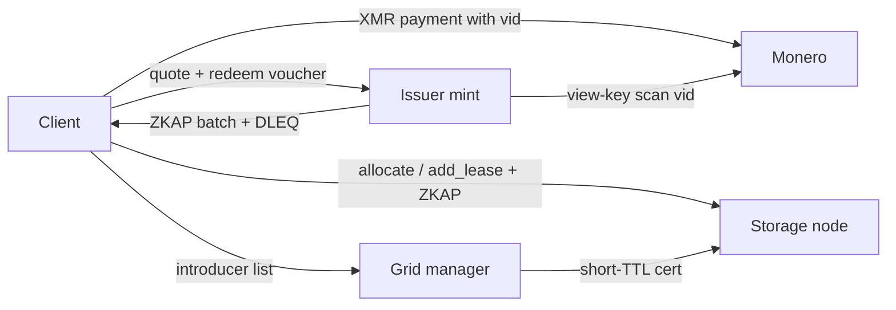

# 01 — Architecture

## Roles

| Role | Trust | Sees |
|---|---|---|
| Client | Holds caps, tokens, view of own shares | Own plaintext (local), own XMR spend, own token wallet |
| Issuer | Trusted for *credit issuance only* | XMR intake (view key), amounts, timing, `vid`; not caps, not share bytes |
| Storage node | Untrusted for confidentiality / integrity (Tahoe already assumes this) | Ciphertext shares, client source address unless Tor, redeemed token transcripts bound to `R` |
| Introducer / grid manager | Trusted for *membership listing*, not for data | Nodeids, FURLs, advertised capacity, cert expiry; not files |
| Repair agent | Optional; same trust as the client it acts for | Whatever caps the client gave it |
| Auditor (B-lite only) | Trusted for attesting nodeid failure, not files | Reachability and optional client reports bound to nodeid |

The issuer is a mint, not a disk. A node that also issues is allowed in a one-box lab and is a privacy regression. Split them as soon as two machines exist.

Tahoe **caps** are object-capability URIs. They are not CephX ACL strings (`allow rwx pool=…`). Never put a Tahoe cap on-chain or in a payment memo.

## Rails

- **Rail A (C, required):** XMR payment → `vid` → ZKAP batch → spend tokens on Tahoe allocate / lease renew.
- **Rail B (optional):** node-named lock on a scriptable rail or 2-of-3 XMR escrow. Certificate field `bond_ref`. See `docs/05-bonds.md`.

Atomic swaps are an **on-ramp** only (node converts XMR income to BTC collateral). They are not the slash condition.

## Layering (do not fork layer 0)

0. Tahoe unchanged: caps, CHK, zfec, leases, GBS/HTTPS.
1. Payment: XMR integrated address whose 8-byte encrypted payment ID is `vid`. Side channel issues ZKAPs.
2. Authorization: storage plugin requires a valid unspent ZKAP bound to `R` before allocate / add_lease / renew that consumes quota.
3. Membership: grid-manager certs, short TTL, cheap liveness probe of the storage FURL, silent eject.
4. Repair: client or repair daemon. Pay tokens for replacement shares. Stop paying the dead node.
5. Optional bond advertisement. Stop. Do not start an L1.

## Encoding and pricing

Keep 3-of-10 or 5-of-16. Price **share-byte-months on one node**, not plaintext TB. Expansion is real cost.

v0 denomination: **1 token = 1 GiB-share × 30 days on one node**. Tokens do not split. Overpay and hold change as extra tokens. A 1 GiB plaintext object at 3-of-10 costs on the order of 3.3 GiB-share across the grid per month after expansion; clients must count per-node leases, not one token per file.

Reads are free at the protocol layer in v0. Charging egress is a different threat model.

## Software map

| Piece | Reuse | Write later |
|---|---|---|
| Grid, caps, FEC, leases | Tahoe-LAFS | config only |
| Membership | Tahoe grid-manager certs | short TTL, probe, eject policy |
| Tokens | ZKAPAuthorizer + challenge-bypass-ristretto | denomination, `R` schema, spend-set |
| Pay | monero-lws or wallet RPC + integrated addresses | quote API, `vid` lifecycle |
| Transport | Tor onion for issuer and nodes | mandatory for the privacy claim, optional for a lab |
